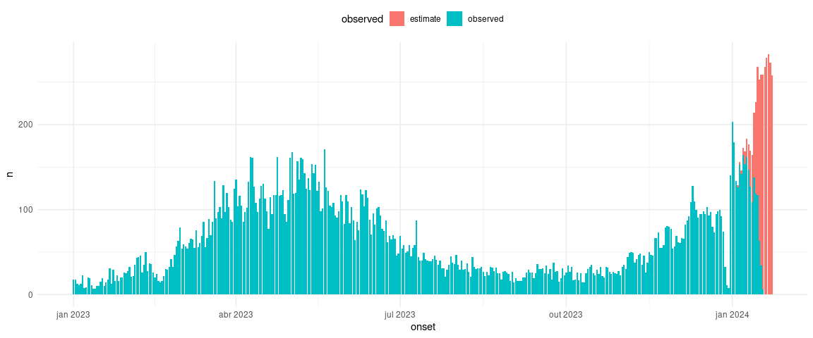

<!-- README.md is generated from README.Rmd. Please edit that file -->

# nowcastingv2

<!-- badges: start -->
<!-- badges: end -->

`{nowcastingv2}` is based on existing package
[nowcaster](https://covid19br.github.io/nowcaster/), and proposes an
extension on the time structures used by `{INLA}` models allowing for
time-varying delay effects. It is specially useful when the pattern of
delays changes over time, which is feasible given differences in
epidemic patterns and surveillance policies. It also extends the outputs
generated, allowing for daily estimates visualizations, as well as time
varying delays and day-of-week effects.

This R package was developed in Rio de Janeiro’s Health Secretariat, at
the [Center of Epidemiological Intelligence
(CIE)](https://epirio.svs.rio.br/), during [Dengue 2024
outbreak](https://www.atachcommunity.com/resources/first-wins-library/effective-preparedness-and-response-to-dengue-through-multisectoral-coordination/)
in the city.

## Installation

This package depends on the `INLA` package, which is not on CRAN. You
must install it manually:

``` r
install.packages("INLA", 
  repos = c(getOption("repos"), INLA = "https://inla.r-inla-download.org/R/stable")
)
```

And then:

``` r

devtools::install_github("https://github.com/joaohmorais/nowcastingv2")
```

## Example

We exemplify the package’s functionalities with data from Rio’s Dengue
epidemic:

``` r
library(nowcastingv2)

head(dengue_rio)
#>   ID_AGRAVO ID_MN_RESI DT_NOTIFIC DT_SIN_PRI  DT_DIGITA CLASSI_FIN
#> 1       A90     330455 2023-01-02 2023-01-01 2023-01-03         10
#> 2       A90     330455 2023-01-02 2023-01-01 2023-02-01         10
#> 3       A90     330455 2023-01-03 2023-01-01 2023-01-10         10
#> 4       A90     330455 2023-01-03 2023-01-02 2023-01-23         10
#> 5       A90     330455 2023-01-03 2023-01-01 2023-01-13         10
#> 6       A90     330455 2023-01-03 2023-01-02 2023-01-04         10
```

The function is fitted based on microdata. Here we have the onset date
(`DT_SIN_PRI`) and report date (`DT_DIGITA`), as defined in Brazil’s
SINAN system. We can check the delay distribution:

``` r
(dengue_rio$DT_DIGITA - dengue_rio$DT_SIN_PRI) |>
  as.integer() |>
  quantile(probs = seq(0, 1, by=0.05))
#>   0%   5%  10%  15%  20%  25%  30%  35%  40%  45%  50%  55%  60%  65%  70%  75%  80%  85%  90%  95% 100% 
#>    0    1    2    3    3    4    4    5    5    6    6    7    7    8    9   10   12   15   20   34  370
```

We then fit the nowcasting model informing, mainly, the variable names
for both dates:

``` r
ncast_fit <- dengue_rio |>
  nowcasting_v2(
    onset_var = "DT_SIN_PRI",
    report_var = "DT_DIGITA",
    time_struc = "rw1", 
    max_delay = 15,
    days_forecast = 5
  )
```

The resulting object is a list of 4 `tibbles`, but the main one is
`daily_estimates`.

``` r
head(ncast_fit$daily_estimates)
#>        onset observed  n epi_week epi_year
#> 1 2023-01-01 observed 18        1     2023
#> 2 2023-01-02 observed 18        1     2023
#> 3 2023-01-03 observed 13        1     2023
#> 4 2023-01-04 observed 11        1     2023
#> 5 2023-01-05 observed 13        1     2023
#> 6 2023-01-06 observed 23        1     2023
```

Based on that object, we can generate the following plots:

``` r
library(tidyverse)
ncast_fit$daily_estimates %>% 
  ggplot(aes(x=onset, y=n)) + 
  geom_bar(aes(fill=observed), stat="identity", position = "stack") + 
  theme_minimal() + 
  theme(legend.position = "top")
```



We can check how the delay effects change over time:

``` r
head(ncast_fit$delay_matrix_df)
#> # A tibble: 6 × 11
#>   week_id epi_week epi_year delay   mean     sd  q_025   q_50   q_975   mode          kld
#>     <int>    <dbl>    <dbl> <dbl>  <dbl>  <dbl>  <dbl>  <dbl>   <dbl>  <dbl>        <dbl>
#> 1       1        1     2023     0 -1.77  0.191  -2.15  -1.77  -1.40   -1.77  0.0000000516
#> 2       1        1     2023     1 -0.325 0.134  -0.600 -0.321 -0.0723 -0.321 0.000000161 
#> 3       1        1     2023     2  0.359 0.111   0.133  0.362  0.572   0.362 0.000000117 
#> 4       1        1     2023     3  0.579 0.106   0.357  0.583  0.776   0.600 0.000000334 
#> 5       1        1     2023     4  0.719 0.0987  0.513  0.724  0.902   0.739 0.000000322 
#> 6       1        1     2023     5  0.660 0.0934  0.466  0.663  0.834   0.663 0.000000231

ncast_fit$delay_matrix_df %>% 
  mutate(week_date = aweek::get_date(epi_week, epi_year)) %>% 
  ggplot(aes(x=week_date)) + 
  geom_ribbon(aes(ymin=q_025, ymax=q_975), alpha=0.3) + 
  geom_line(aes(y=q_50, group=delay, color=q_50 > 0)) + 
  geom_hline(yintercept = 0, linetype="dashed") +
  guides(color = "none") +
  facet_wrap(~delay) + 
  theme_bw()
```


We can see that, in this example, notifications with 1-day delay became
more frequent over time, and delays \>= 10 days had the opposite effect.
This justifies the needs to take into account time varying delay
effects.

Finally, we can plot the weekly estimates with their credible intervals
(95%):

``` r
ncast_fit$delay_df %>% 
  filter(onset <= ymd("2024-01-20")) %>% # only complete weeks
  mutate(
    n = case_when(
      is.na(n_obs) ~ n,
      TRUE ~ n_obs
    ),
    low = case_when(
      is.na(n_obs) ~ low,
      TRUE ~ n_obs
    ),
    upp = case_when(
      is.na(n_obs) ~ upp,
      TRUE ~ n_obs
    )
  ) %>% 
  summarise(n_obs = sum(n_obs, na.rm=T),
            n=sum(n, na.rm=T),
            low = sum(low, na.rm=T),
            upp = sum(upp, na.rm=T),
            .by=c(epi_week, epi_year)) %>% 
  mutate(week_day = aweek::get_date(epi_week, epi_year)) %>% 
  ggplot(aes(x=week_day)) + 
  geom_ribbon(aes(ymin=low, ymax=upp), alpha=0.3) + 
  geom_line(aes(y=n_obs, linetype="Observed")) + 
  geom_line(aes(y=n, linetype="estimated")) + 
  scale_linetype_manual(values = c("dashed", "solid"), name = "") +
  theme_bw() + 
  theme(legend.position = "top")
```


